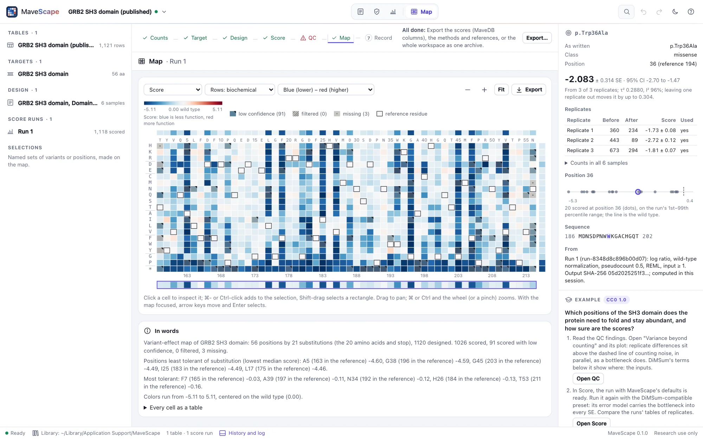

# MaveScape

<picture>
  <source media="(prefers-color-scheme: dark)" srcset="docs/images/map-dark.webp">
  
</picture>

MaveScape is a free, open-source (Apache 2.0) workbench for multiplexed assays of variant effect
(MAVEs), starting with protein deep mutational scanning. It turns variant count tables into
checked, uncertainty-aware variant-effect scores and maps, with quality control, comparison and
protein structure, and keeps every analysis decision on record.

It runs on your own computer as one self-contained program, with no account, Python or R. Files
are analyzed in the browser and never leave your machine. MaveScape reports experimental
functional effects for research; it does not classify variants as pathogenic or benign.

**[Website and user guide](https://robert-mcdermott.github.io/mavescape/)**: getting started,
opening your data, scoring, quality control, the map, the record and scripting, with screenshots.

> **Status: 0.1.0 released; 0.2.0 in progress.** Count tables import, designs are set in the
> Experiment view, two-population experiments (by log ratio or DiMSum's fitness and error model),
> time series (by weighted regression on every time point), sorted bins (by their weighted average
> or maximum likelihood) and barcoded libraries (their barcodes summed, or each scored and
> combined, with a barcode-to-variant map) are scored, and conditions compared (limma, or pairs of
> replicates sharing an input), with numbers checked against Enrich2, dms_variants, DiMSum, mutscan,
> statsmodels, fitdistrplus, metafor and published scores; quality control reports its findings,
> the variant-effect map shows each run and each difference between conditions, and a workspace
> saves to one archive that reopens identically. A million rows import in a few seconds. Scripts
> can drive the window (`--remote-control`), and `mavescape run` does a whole analysis without one,
> the same bytes every time. A design says what the assay measures, and every QC finding what could
> cause it and what to do. Replicates are combined under a shared error model whose 95% intervals
> hold the truth 94–97% of the time in 26 kinds of simulated experiment. Six examples are on the Start page;
> [`docs/FORMATS.md`](docs/FORMATS.md) describes every file. The
> [roadmap](mavescape-spec/roadmap.md) finishes 0.2 with help assembling a complete analysis
> package, and more examples.

## What is a MAVE?

A **multiplexed assay of variant effect** (MAVE) measures what thousands of variants of a gene or
protein do, in one experiment. A library of variants is put through a selection (cells grow, a
protein binds, or cells are sorted by a fluorescent reporter), and sequencing counts every variant
before and after. In a selection for function, a variant that becomes rarer has probably lost some
of it; what a score means always depends on what the assay selects for. Protein **deep mutational
scanning** (DMS) is the most common MAVE, and the one MaveScape starts with; other MAVEs test
regulatory sequences or edit variants into the genome.

The path from the bench to a result:

**experiment → sequencing reads → variant counts → MaveScape → (optionally) MaveDB**

Tools such as Enrich2, DiMSum or dms_variants turn the reads into counts. MaveScape starts from those
counts, the target's sequence and the experiment's design (which column is which sample, replicate,
time point or bin). It turns them into scores with their uncertainty, quality control and a map.
[MaveDB](https://www.mavedb.org) is the public repository of MAVE data. MaveScape is a separate
program that needs no MaveDB account, and it writes scores in MaveDB's columns. Published scores
without their counts can be explored, but they cannot be rescored or checked by count-based quality
control.

## Install

**macOS and Linux**

```sh
curl --proto '=https' --tlsv1.2 -fsSL https://raw.githubusercontent.com/robert-mcdermott/mavescape/main/install.sh | sh
```

**Windows** (PowerShell)

```powershell
irm https://raw.githubusercontent.com/robert-mcdermott/mavescape/main/install.ps1 | iex
```

The installers check the download against `SHA256SUMS` and its version before installing, and
need no administrator rights ([docs/INSTALLING.md](docs/INSTALLING.md)). Then run `mavescape`: it
opens in its own window.

## What you bring

- **Variant counts**: a table with one row per variant and one column per sample (CSV, TSV or
  Excel), as Enrich2, DiMSum, dms_variants or a lab's own scripts write them, or one file per
  sample; or a table of barcode counts with its barcode-to-variant map.
- **The target sequence** the variants are named against (FASTA, or pasted).
- **The design**: which column is which sample, its role, condition and replicate; a sample sheet
  fills it in.
- Or **published scores**, from MaveDB and other sources.

MaveScape starts from counts; reads (FASTQ) are counted by those upstream tools.

## Command-line options

| Option | Meaning |
| --- | --- |
| `mavescape [files or folders]` | Start and open the files (tables, sequences, structures, workspaces) |
| `--port N` | Preferred port (default 8820; the next 19 are tried) |
| `--window app\|browser\|none` | A desktop window (Chrome, Edge, Brave or Chromium), the default browser, or none |
| `--data-dir DIR` | Where the workspace library is kept |
| `--no-library` | Keep workspaces in the browser's storage instead |
| `--keep-running` | Keep serving after the window is closed |
| `--remote-control` | Let programs on this computer drive the window ([scripting](https://robert-mcdermott.github.io/mavescape/docs/scripting.html)) |
| `--version` | Print the version |
| `mavescape run --design D --out DIR counts.csv` | Score without a window, write the files and `run.json` ([headless runs](https://robert-mcdermott.github.io/mavescape/docs/scripting.html#headless)) |
| `mavescape validate [--design D] [tables]` | Check tables and a design as scoring would; exit 1 when something blocks scoring |

A second `mavescape <files>` hands its files to the window already open.

MaveScape stops when its window closes. On macOS, Chrome (and Edge, Brave) keeps running after its
last window is closed: quit it with ⌘Q to stop MaveScape too. If that browser is still running
when MaveScape starts, the new window opens in it and MaveScape keeps serving until Ctrl+C.

## Scripting

With `--remote-control`, programs on this computer can drive the open window: open an example or
files, draft the design, score, read the QC findings, select variants, render the map and export,
each step visible in the window and undoable. MaveScape writes its address and a token (needed to
read or write files) to `remote.json` in its data folder:

```sh
mavescape --remote-control
curl -s http://127.0.0.1:8820/api/remote/action -d '{"action": "open_example", "args": {"id": "grb2"}}'
curl -s http://127.0.0.1:8820/api/remote/action -d '{"action": "qc_findings"}'
```

`GET /api/remote/tools` lists the actions with their arguments. The documentation's screenshots
are made this way (`docs/capture/capture.mjs`).

For pipelines, `mavescape run` does the whole analysis without a window (in a headless Chrome)
and writes the scores, counts, QC, map, methods, provenance, the workspace archive and `run.json`
to a folder; `--time` (or `SOURCE_DATE_EPOCH`) makes every file the same bytes for the same inputs,
`--from-workspace` reruns a saved run exactly, and `--strict` fails on any failing QC finding not
acknowledged (`--acknowledge id=reason` for one expected here):

```sh
mavescape validate --design design.json counts.csv
mavescape run --design design.json --out results/ --time 2026-10-09T12:00:00Z counts.csv
mavescape run --from-workspace results/workspace.msz --out rerun/
mavescape run --design design.json --out strict/ --strict --acknowledge "coverage=an error-prone PCR library" counts.csv
```

## Privacy and security

MaveScape listens on 127.0.0.1 only, refuses requests whose Host header is not this computer and
API calls from other web pages, and serves its page with a strict Content-Security-Policy. It
makes no network requests of its own; remote control is off unless asked for, and then answers
only programs on this computer; public-data fetching (MaveDB, UniProt, PDB, AlphaFold) will
come through a fixed list of services and can be switched off (`--offline`).

## Development

Requirements: Go (the version in `go.mod` or newer) and Node 22 for the tests. There are no
dependencies to install.

```sh
go run . --dev                    # serve web/ from disk, edits show on reload
go test -race ./...               # the host
node --test "web/lib/*.test.mjs"  # the browser modules
node validation/run.mjs           # the validation suites
node validation/remote-session.mjs  # every remote action in the program and headless Chrome
node validation/headless-run.mjs    # mavescape run and validate: the same bytes twice, reruns, failures
node docs/capture/capture.mjs     # the screenshots (docs/images/), through remote control
node docs/site/build.mjs /tmp/site  # the website, with every link and screenshot checked
```

The web app also runs from any static web server (`python3 -m http.server --directory web`),
with the workspace library in the browser.

### Code layout

```
main.go, security.go, local.go, store.go, records.go, window.go   the Go host
remote.go, actions.go, connection.go, output.go                   remote control
web/index.html, web/styles.css, web/app.js                        the app shell
web/lib/       pure modules (no DOM): parsing, scoring, QC; run in Node, workers and the page
web/ui/        views and components
validation/    comparisons with reference tools and fixtures
docs/          file formats, installation; capture/ (screenshots) and site/ (the website)
mavescape-spec/  requirements, design, roadmap, research and conventions
```

MaveScape is a sibling of [CytoWeave](https://github.com/robert-mcdermott/cytoweave) (flow
cytometry) and Proteoscope (protein structure). It shares their architecture and copies some of
their code, noted in each file; it does not depend on either.

## License, citation

Apache License 2.0 ([LICENSE](LICENSE)). To cite MaveScape, see [CITATION.cff](CITATION.cff).
